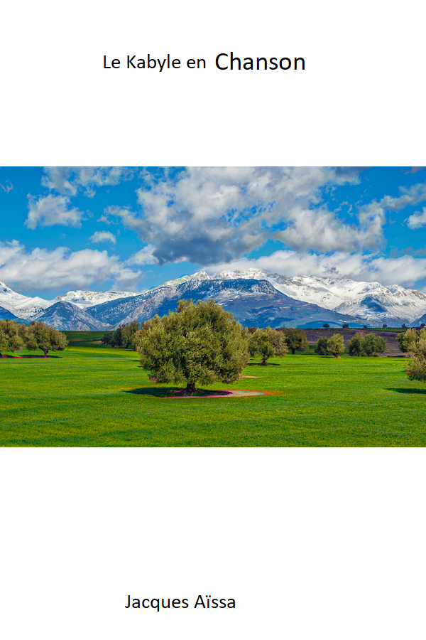

# Le Kabyle en Musique

Je vous recommande de lire ce livre dans cet ordre mais vous pouvez aussi sauter à une partie de votre choix

# La Règle des 3P+1

N'oubliez pas que le travail c'est avant tout : Passion, Persévérence, Pratique + Patience, mais vous pouvez aussi me motiver pour cette histoire de **patience** en cliquant sur cette image 

# License & Copyright

Cover Image [TOP DESTINATION](https://topdestinationsalgerie.com/11-beaux-parcs-nationaux-a-visiter-en-algerie/le-parc-national-du-djurdjura/)

The original **Le Manuel du CSS** is licensed under a [Creative Commons Attribution-ShareAlike 3.0 Unported License][license]. You are free:

* to Share—to copy, distribute and transmit the work
* to Remix—to adapt the work
* to make commercial use of the wor
