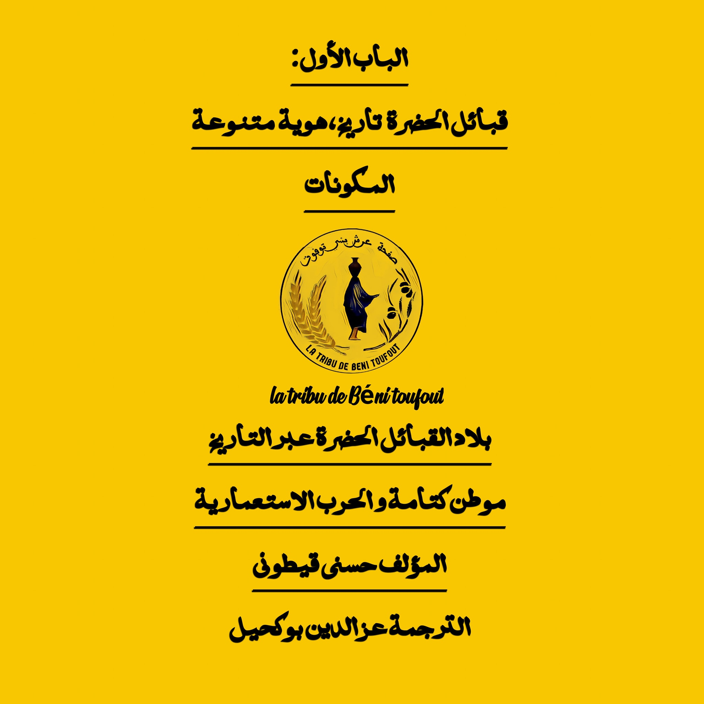

الفصل الأول
من النوميديين الى الكتاميين
1. العودة إلى فجر التاريخ
لا يمكننا أن نتكلم عن هذا التاريخ بمعزل عن تاريخ إفريقيا الشمالية بوجه عام،
فلفهم الوقائع الخاصة بهذه المنطقة، لابد من فحص العناصر المعرفية التي من شأنها أن تلقـي بضوئها على منطقة المغرب بكاملها ، وهي التي تعد احدى مهود البشرية .
فالآثار الأولى للجنس البشري التي تم العثور عليها في عين لحنش (العلمة)، ترجع إلى مليوني سنة خلت. وبالمقابل لم تتوفر نفس الفرصة للغوص بعيدا في أغوار تاريخ بلاد القبائل الحضرة بسبب الطبيعة الخلابة التي غطت تحت ردائها الكثيف من الخضرة
والنبات كافة أسرارها. فمن ضمن أقدم الشواهد التي تركها أسلافنا، نجد بعض الحجارة المنحوتة، وبعض الرماح، وأواني منزلية وبقايا المنازل، ونجد بالخصوص المعالم التي كانوا يدفنون فيهـا مـوتاهـم. فالأثار الأكثر تعبيرا هي بطبيعة الحال المدافن. بحيث تدل عن
مدى الأهمية التي كان أجدادنا يولونها لمراسيم الدفن، وكأنهم يريدون من وراء ذلك اطلاع الأجيال التي تأتي من بعدهم عن نمط حياتهم. فقد تم العثور على هذه البنايات الجنائزية على امتداد الساحل بين القل وجيجل، موزعة بصفة غير متساوية بين غرب
المنطقة وشرقها، وتعد من حيث أحجامها، وهندستها الداخلية، والمقتنيات الجنائزية الموضوعة فيها ، كتابا مفتوحا على الماضي، لا يذهب، لسـوء الحظ، أبعـد مـن الـقـرن السادس قبل الميلاد، زد على ذلك، فانه من العبث البحث عن اي تسلسل تاريخي داخل
هذه الأشياء الموجودة.
بالإضافة إلى ما سبق نجـد نصـوصـا أيضا. فعلى عكس ماكنـا نعتقد، فإن منطقة شمال إفريقيا كانت محط اهتمام الجغرافيين والمؤرخين لحقبة ما قبل التاريخ، منهم هيرودوت Hérodote (484 425 ق.م.) وسالوست Salluste (86 ق.م -35 ق.م)، بليـن
القديم Pline (79-23) وبطوليمي Ptolémée (170-100)، وغيرهم. وتكمن أهمية كتاباتهم، التي تختلط فيها الأساطير بالواقع، في كونها تعود بنا إلى أزمنة غابرة تمتد إلى فجر التاريخ، ففي الوقت الذي لا تقدم لنا الآثار أي سند لفهم ما حدث هناك، تلقي
علينا هاته الكتابات المؤسسة بأنوار لتساعدنا على تخيل أو تصور الأجداد الذين شيدوا هذه المقابر.
